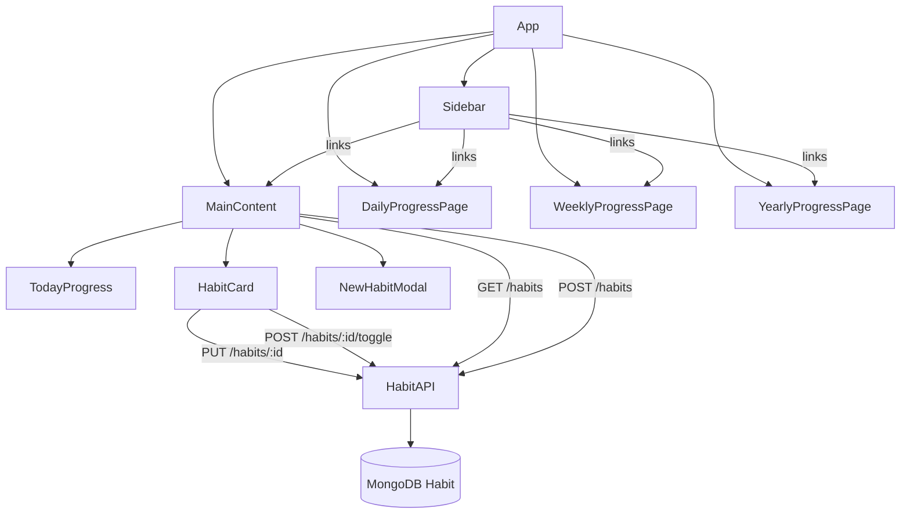

# Design Document: Habit Tracker Dashboard

## Overview

This document describes the technical design for the Habit Tracker Dashboard feature. The dashboard is the primary view of the application, showing only today's habits in a focused, distraction-free dark-themed UI. Three separate progress pages (Daily, Weekly, Yearly) are accessible via sidebar navigation. The design covers frontend component changes, new page components, backend model/API updates, and a dark-mode Tailwind theme.

The existing stack is React + Vite, Tailwind CSS, Express.js, MongoDB, JWT auth, and Recharts. All changes are additive or modifications to existing files — no new libraries are required.

## Architecture



Routing is handled by `activeSection` state in `App.jsx` (existing pattern). No React Router is introduced. The `renderContent()` switch in `App.jsx` is extended with three new cases: `daily`, `weekly`, `yearly`.

The `RightSidebar` component is removed from the layout — it is not part of the new dashboard design. The layout becomes: fixed left `Sidebar` + full-width `MainContent` area (no right sidebar offset).

## Components and Interfaces

### Tailwind Dark Theme Tokens

`tailwind.config.js` is extended with a custom color palette and the `darkMode: 'class'` strategy is not needed — the app is dark-only, so dark colors are used directly as base classes.

```js
// tailwind.config.js additions
theme: {
  extend: {
    colors: {
      surface: {
        base: '#111827',   // page background (gray-900)
        card: '#1f2937',   // habit card background (gray-800)
        modal: '#1f2937',  // modal background
        sidebar: '#0f172a' // sidebar background (slate-900)
      },
      accent: {
        blue:   '#3b82f6', // primary actions
        green:  '#10b981', // completed state
        purple: '#8b5cf6', // progress/analytics
      }
    },
    animation: {
      shake: 'shake 0.5s ease-in-out',
      'fade-in': 'fadeIn 0.2s ease-out',
      'slide-up': 'slideUp 0.25s ease-out',
    },
    keyframes: {
      shake: { '0%,100%': { transform: 'translateX(0)' }, '25%': { transform: 'translateX(-10px)' }, '75%': { transform: 'translateX(10px)' } },
      fadeIn: { from: { opacity: 0 }, to: { opacity: 1 } },
      slideUp: { from: { opacity: 0, transform: 'translateY(8px)' }, to: { opacity: 1, transform: 'translateY(0)' } },
    }
  }
}
```

### App.jsx

- Remove `RightSidebar` import and render.
- Remove `selectedDate` / `habits` state (no longer needed at App level).
- Extend `renderContent()` switch with `daily`, `weekly`, `yearly` cases.
- Root `div` background: `bg-[#111827]`.

### Sidebar

Props: `{ activeSection, setActiveSection }` (unchanged).

Updated `menuItems`:

```js
[
  { id: "habits", label: "Dashboard", icon: <Home /> },
  { id: "daily", label: "Daily Progress", icon: <BarChart2 /> },
  { id: "weekly", label: "Weekly Progress", icon: <TrendingUp /> },
  { id: "yearly", label: "Yearly Progress", icon: <Calendar /> },
  { id: "areas", label: "Areas", icon: <Grid /> },
];
```

Dark styling: sidebar background `bg-[#0f172a]`, active item `bg-blue-600`, text `text-gray-300`, hover `hover:bg-gray-800`.

### MainContent (Dashboard)

- Remove category filter bar and `activeFilter` state.
- Remove `selectedDate` prop dependency (always uses `new Date()` for today).
- Add `TodayProgress` sub-component at the top.
- Add "Add Habit" button (blue accent).
- Keep active/completed grouping.
- Background: `bg-[#111827]`, layout: `lg:ml-64` (no right offset).

### TodayProgress (new sub-component inside MainContent)

Props: `{ completed: number, total: number }`.

Renders:

- Text: `{completed} / {total} completed`
- `<div>` progress bar: width = `${Math.round((completed/total)*100)}%`, color `bg-blue-500`, transition `transition-all duration-500`.
- When `completed === total && total > 0`: show congratulatory message.

### HabitCard

Changes:

- Dark card background: `bg-[#1f2937]`, border `border-gray-700`.
- Completed state: border `border-green-500/40`, subtle green tint `bg-green-900/10`.
- Add `timeGoal` display: when `habit.timeGoal` is set, render a small badge `⏱ {habit.timeGoal}` below description.
- Edit mode inputs: dark background `bg-gray-700`, border `border-gray-600`, text `text-white`.
- Save button: `bg-blue-600 hover:bg-blue-700`.
- Cancel button: `bg-gray-700 hover:bg-gray-600 text-gray-200`.
- Error state: local `error` string state, shown as red text below inputs on API failure.
- Validation: if `editName.trim()` is empty on save, set local validation message, do not call API.

### NewHabitModal (AddHabitModal)

Changes:

- Dark background: `bg-[#1f2937]`, text `text-white`.
- Add `timeGoal` input field (optional, text, after description).
- Remove category selector and frequency selector (simplified for dashboard focus — these can remain as optional advanced fields, but timeGoal is the new required addition).
- Error state: local `error` string, shown on API failure, modal stays open.
- On close without submit: reset all fields.
- Overlay: `bg-black/80`.

### Button

Add new variant tokens for dark theme:

```js
variants: {
  primary: 'bg-blue-600 hover:bg-blue-700 text-white focus:ring-blue-500',
  secondary: 'bg-gray-700 hover:bg-gray-600 text-gray-200 focus:ring-gray-500',
  danger: 'bg-red-600 hover:bg-red-700 text-white focus:ring-red-500',
  ghost: 'hover:bg-gray-700 text-gray-300 focus:ring-gray-500',
  success: 'bg-green-600 hover:bg-green-700 text-white focus:ring-green-500',
}
```

### Login / Register

Dark background: `bg-[#111827]`, card `bg-[#1f2937]`, inputs `bg-gray-700 border-gray-600 text-white`, submit button uses blue accent.

### DailyProgressPage (new)

Route: `activeSection === 'daily'`.

Fetches `/habits` and computes per-habit daily completion for the last 30 days from `completedDates`.

Renders a Recharts `BarChart` per habit (or a grouped bar chart) showing completion count per day. Chart theme: dark background `#1f2937`, grid lines `#374151`, axis text `#9ca3af`, bar fill `#3b82f6`.

Layout: `lg:ml-64 min-h-screen bg-[#111827] p-8`.

### WeeklyProgressPage (new)

Route: `activeSection === 'weekly'`.

Fetches `/habits` and aggregates completions by ISO week for the last 12 weeks.

Renders a Recharts `LineChart` showing weekly completion rate (%) per habit or overall. Chart theme same as Daily. Line color `#8b5cf6`.

### YearlyProgressPage (new)

Route: `activeSection === 'yearly'`.

Fetches `/habits` and aggregates completions by month for the current year.

Renders a Recharts `BarChart` with monthly totals and a summary stat card (total completions, best month, current streak). Bar fill `#10b981`.

## Data Models

### Habit (MongoDB / Mongoose)

```js
// server/models/Habit.js — add timeGoal field
{
  userId:        { type: ObjectId, ref: 'User', required: true },
  name:          { type: String, required: true },
  description:   String,
  timeGoal:      String,   // NEW — optional, no default
  frequency:     { type: String, enum: ['daily','weekly','yearly','custom'], default: 'daily' },
  customDays:    { type: Number, min: 1, default: null },
  category:      { type: String, enum: ['Well Being','Health','Productivity','Learning'], default: 'Well Being' },
  completedDates: [{ type: Date }],
}
```

`timeGoal` is a free-text string (e.g., `"2 hours training"`). No validation beyond type — it is fully optional. Existing habits without `timeGoal` will have `undefined` for the field, which the API returns as absent from the JSON object.

### API Changes

`POST /habits` — `createHabit` controller: destructure `timeGoal` from `req.body`, include in `Habit.create({...})`.

`PUT /habits/:id` — `updateHabit` controller: destructure `timeGoal` from `req.body`, include in `findOneAndUpdate` payload.

No new routes are needed. The progress pages compute their data client-side from the existing `GET /habits` response (which includes `completedDates`).

### Habit API Response Shape (unchanged except new field)

```json
{
  "_id": "...",
  "name": "Morning Run",
  "description": "Run 5km",
  "timeGoal": "45 minutes",
  "frequency": "daily",
  "category": "Health",
  "completedDates": ["2025-01-15T00:00:00.000Z"],
  "progress": 85,
  "streak": 3,
  "createdAt": "...",
  "updatedAt": "..."
}
```

### Client-Side Progress Computation

For progress pages, data is derived from `habit.completedDates`:

```js
// Daily: completions per day for last N days
const dailyData = (habit, days = 30) => {
  const result = [];
  for (let i = days - 1; i >= 0; i--) {
    const d = new Date();
    d.setDate(d.getDate() - i);
    d.setHours(0, 0, 0, 0);
    const completed = habit.completedDates.some(
      (cd) => new Date(cd).setHours(0, 0, 0, 0) === d.getTime(),
    );
    result.push({
      date: d.toLocaleDateString("en-US", { month: "short", day: "numeric" }),
      completed: completed ? 1 : 0,
    });
  }
  return result;
};

// Weekly: completion count per ISO week for last 12 weeks
// Yearly: completion count per month for current year
```

## Correctness Properties

_A property is a characteristic or behavior that should hold true across all valid executions of a system — essentially, a formal statement about what the system should do. Properties serve as the bridge between human-readable specifications and machine-verifiable correctness guarantees._

### Property 1: HabitCard renders all habit fields

_For any_ habit object with name, description, and timeGoal set, the rendered HabitCard output should contain the habit's name, description, and timeGoal text.

**Validates: Requirements 1.2, 2.1**

### Property 2: timeGoal absent when not set

_For any_ habit object where timeGoal is undefined or null, the rendered HabitCard should not contain any time goal element or placeholder text.

**Validates: Requirements 2.2**

### Property 3: timeGoal round-trip persistence

_For any_ valid timeGoal string, creating a habit with that timeGoal via the API and then fetching it should return a habit whose timeGoal equals the original string. The same holds for update operations.

**Validates: Requirements 2.3, 2.4**

### Property 4: Habit grouping is exhaustive and disjoint

_For any_ list of habits, after splitting into active and completed groups, every habit appears in exactly one group, and a habit is in the completed group if and only if its completedDates contains today's date.

**Validates: Requirements 1.3, 1.4**

### Property 5: Toggle is a round-trip

_For any_ habit, toggling it twice (complete then incomplete, or incomplete then complete) should return the habit to its original completion state for today.

**Validates: Requirements 3.1, 3.2**

### Property 6: Toggle failure preserves state

_For any_ habit and a simulated API failure on toggle, the habit's completion state in the UI should remain unchanged from before the toggle attempt.

**Validates: Requirements 3.4**

### Property 7: Edit mode pre-fills current values

_For any_ habit, entering edit mode should result in the name input containing the habit's current name and the description input containing the habit's current description.

**Validates: Requirements 4.1, 4.2**

### Property 8: Cancel edit restores original values

_For any_ habit and any edits made to name/description in edit mode, activating Cancel should result in the displayed name and description matching the original values before editing began.

**Validates: Requirements 4.5**

### Property 9: Edit failure preserves input and keeps edit mode open

_For any_ habit edit attempt where the API returns an error, the HabitCard should remain in edit mode and the input fields should still contain the user's entered values.

**Validates: Requirements 4.6**

### Property 10: Progress bar percentage is mathematically correct

_For any_ list of habits where total > 0, the progress bar fill percentage should equal Math.round((completedCount / totalCount) \* 100), and the displayed text should show the correct counts.

**Validates: Requirements 5.1, 5.2**

### Property 11: Adding a habit grows the active group

_For any_ dashboard state and any valid habit name, successfully submitting the AddHabitModal should result in the active habits list containing the new habit and the total count increasing by one.

**Validates: Requirements 6.4**

### Property 12: Modal close discards data

_For any_ AddHabitModal state with partially entered data, closing the modal without submitting should result in all fields being empty when the modal is next opened.

**Validates: Requirements 6.6**

### Property 13: Create failure keeps modal open with input

_For any_ habit creation attempt where the API returns an error, the AddHabitModal should remain open and the input fields should still contain the user's entered values.

**Validates: Requirements 6.5**

### Property 14: Progress pages render data for each habit

_For any_ set of habits with completion history, each of the DailyProgressPage, WeeklyProgressPage, and YearlyProgressPage should render a chart or data element for each habit in the set.

**Validates: Requirements 7.2, 7.3, 7.4**

## Error Handling

| Scenario                        | Behavior                                                                 |
| ------------------------------- | ------------------------------------------------------------------------ |
| `GET /habits` fails on load     | Show error banner in MainContent; retry button                           |
| `POST /habits/:id/toggle` fails | Revert optimistic UI update; show inline error toast                     |
| `PUT /habits/:id` fails         | Stay in EditMode; show error message below inputs                        |
| `POST /habits` (create) fails   | Keep AddHabitModal open; show error message inside modal                 |
| Empty habit name on submit      | Client-side validation; show "Name is required" message; do not call API |
| Empty habit name on edit save   | Client-side validation; show "Name cannot be empty"; do not call API     |
| Network offline                 | Axios interceptor catches; show generic "Network error" toast            |

Error notifications are transient inline messages (not browser `alert()`). Each component manages its own `error` string state. Errors clear on the next successful action or when the user dismisses.

## Testing Strategy

### Dual Testing Approach

Both unit tests and property-based tests are required. They are complementary:

- Unit tests cover specific examples, integration points, and edge cases.
- Property tests verify universal correctness across randomized inputs.

### Unit Tests (Vitest + React Testing Library)

Focus areas:

- `TodayProgress`: renders correct count text and bar width for specific inputs (0/0, 3/7, 7/7).
- `HabitCard`: edit mode shows pre-filled inputs; cancel restores values; empty name shows validation message.
- `NewHabitModal`: renders name, description, timeGoal fields; close resets state.
- `Sidebar`: renders all 5 navigation links.
- `habitController`: `createHabit` and `updateHabit` persist `timeGoal`; `toggleComplete` toggles correctly.
- Progress page data helpers: `dailyData()`, `weeklyData()`, `yearlyData()` return correct shapes.

Avoid writing unit tests for things already covered by property tests.

### Property-Based Tests (fast-check)

Library: `fast-check` (already compatible with Vitest). Minimum 100 runs per property.

Each property test is tagged with a comment referencing the design property:

```
// Feature: habit-tracker-dashboard, Property N: <property text>
```

| Property                             | Generator                                                                                                     | Assertion                                                                 |
| ------------------------------------ | ------------------------------------------------------------------------------------------------------------- | ------------------------------------------------------------------------- |
| P1: HabitCard renders all fields     | `fc.record({ name: fc.string({minLength:1}), description: fc.string(), timeGoal: fc.string({minLength:1}) })` | rendered output contains name, description, timeGoal                      |
| P2: timeGoal absent when not set     | habit with `timeGoal: undefined`                                                                              | rendered output has no time goal element                                  |
| P3: timeGoal round-trip              | `fc.string({minLength:1})` as timeGoal                                                                        | create → fetch → timeGoal matches                                         |
| P4: Grouping exhaustive and disjoint | `fc.array(habitArb)`                                                                                          | every habit in exactly one group; group membership matches completedDates |
| P5: Toggle round-trip                | `fc.record(habitArb)`                                                                                         | toggle twice → same completion state                                      |
| P6: Toggle failure preserves state   | habit + simulated rejection                                                                                   | state unchanged after failed toggle                                       |
| P7: Edit mode pre-fills              | `fc.record({ name: fc.string({minLength:1}), description: fc.string() })`                                     | inputs contain current values                                             |
| P8: Cancel restores original         | habit + arbitrary edits                                                                                       | displayed values match pre-edit values                                    |
| P9: Edit failure keeps edit mode     | habit + simulated rejection                                                                                   | still in edit mode, inputs unchanged                                      |
| P10: Progress bar math               | `fc.nat()` for completed, `fc.nat()` for total (completed ≤ total)                                            | bar width = Math.round(completed/total\*100)%                             |
| P11: Add habit grows active group    | valid habit name                                                                                              | active list length increases by 1                                         |
| P12: Modal close discards data       | arbitrary partial input                                                                                       | fields empty on reopen                                                    |
| P13: Create failure keeps modal open | valid input + simulated rejection                                                                             | modal open, inputs unchanged                                              |
| P14: Progress pages render per habit | `fc.array(habitArb, {minLength:1})`                                                                           | chart elements count ≥ habit count                                        |

**Configuration**: each `fc.assert(fc.property(...))` call uses `{ numRuns: 100 }`.
